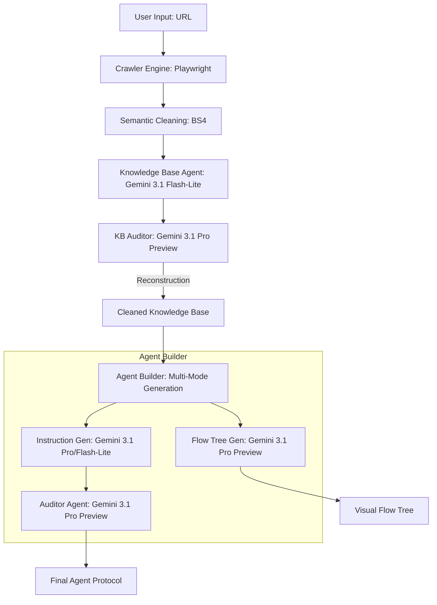

# NanoCrawler Agent Builder | System Architecture

## 1. High-Level Architecture
The system follows a multi-agent, pipeline-based architecture designed for high-fidelity AI Agent configuration from raw web data.

---

## 2. Process Flow & Module Responsibilities

### A. Intelligence Extraction (Crawler & Cleaner)
- **Model**: Playwright (Browser Automation) + BeautifulSoup4 (Cleaning).
- **Process**:
    1. Navigation to URL.
    2. Semantic noise reduction: Automatically strips `<nav>`, `<footer>`, `<header>`, and `<script>` tags.
    3. Text normalization to maximize token efficiency.
    4. Compliance check against `robots.txt` before execution.

### B. Knowledge Base (KB) Synthesis
- **Model**: **Gemini 3.1 Flash-Lite** (for speed) or **Pro Preview** (for depth).
- **Process**: 
    - Analyzes raw text across multiple pages.
    - Structures data into business categories (Company, Products, Pricing, FAQ).
    - **Self-Correction**: The KB Auditor scores the output. If the score is <75%, it triggers a reconstruction pass to fix formatting or missing context.

### C. Agent Instruction Generation
- **Model**: **Gemini 3.1 Pro Preview** (Standard) / **Flash-Lite** (Optimized).
- **Process**:
    - Uses specialized "Industrial Framework" templates.
    - Generates system prompts including Role, Rules, Flow, and Exit Taxonomies.
    - **Streaming**: Data is delivered via `StreamingResponse` to provide instant UI feedback.

### D. Conversational Flow Tree
- **Model**: **Gemini 3.1 Pro Preview**.
- **Process**:
    - Synthesizes the logical decision paths of the agent based on the KB.
    - Outputs raw Mermaid.js syntax for real-time visualization in the dashboard.

---

## 3. Model Selection Strategy

| Mode | Task | Model Used | Justification |
| :--- | :--- | :--- | :--- |
| **Standard** | Instruction Gen | `gemini-3.1-pro-preview` | Maximum reasoning depth for complex industrial protocols. |
| **Optimized** | Instruction Gen | `gemini-3.1-flash-lite` | Sub-5s latency for rapid prototyping. |
| **Auditor** | Logic Check | `gemini-3.1-pro-preview` | Needs high reasoning to verify against strict rules. |
| **Flow** | Mermaid Logic | `gemini-3.1-pro-preview` | Requires precise syntax adherence and logical mapping. |
| **Crawler** | Extraction | `Playwright / Chromium` | Handles dynamic JS-heavy websites reliably. |

---

## 4. Latency Optimization Techniques
1. **Robots Compliance Agent**: Fast HTTP check before heavy browser spin-up.
2. **Semantic Filtering**: Reduces prompt tokens by 60% by removing UI boilerplate.
3. **Parallel Agents**: Running Auditor and Flow Tree agents in parallel to minimize "Wall Clock" time.
4. **FastAPI Async**: Non-blocking I/O for concurrent user requests.
